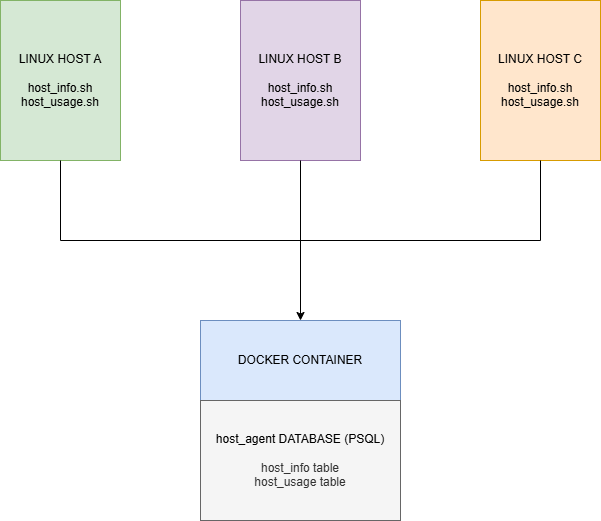

# Linux Cluster Monitoring Agent

## Introduction
Linux Cluster Monitoring Agent is a tool that allows the end user to track hardware information and resource usage across multiple nodes in a cluster. The agent gathers information about CPU, memory, and storage using Bash scripts and saves the information into a PostgreSQL-powered database. The process is automated to gather and store system data and usage data every minute using crontab, containerized using Docker, and version-controlled using Git. The Agent allows users to analyze system usage statistics and trends over time.

## Quick Start
```bash
# start psql instance
./scripts/psql_docker.sh create db_username db_password
# replace db_username and db_password

# setup tables for storing hardware specs and usage data
psql -h localhost -U postgres -d host_agent -f sql/ddl.sql

# manually insert hardware specs into the database
./scripts/host_info.sh localhost 5432 host_agent postgres password

# manually insert usage data into the database
./scripts/host_usage.sh localhost 5432 host_agent postgres password

# automate to run every minute
crontab -e

* * * * * bash /path/to/linux_sql/scripts/host_usage.sh localhost 5432 host_agent postgres password > /tmp/host_usage.log
```

## Implementation
The project is implemented using a combination of Bash scripts, a PostgreSQL database, and Docker. Each host in the cluster runs scripts that collect hardware specs and usage data and insert them into a centralized database. The database is provisioned and managed using a Docker container with a persistent volume to ensure data is retained.

### Architecture


Each host runs the agent scripts independently and inserts data into the shared database. Arrows represent SQL INSERT operations over the network via psql.

### Scripts

**psql_docker.sh** - Manages the PostgreSQL Docker container. It checks if Docker is running, then creates, starts, or stops the container based on the provided argument.
```bash
# create|start|stop psql Docker container
./scripts/psql_docker.sh create|start|stop [db_username] [db_password]

# example
./scripts/psql_docker.sh create postgres password
```

**host_info.sh** - Collects hardware specifications from the host machine and inserts it into the `host_info` table.
```bash
./scripts/host_info.sh [psql_host] [psql_port] [db_name] [psql_user] [psql_password]

# example
./scripts/host_info.sh localhost 5432 host_agent postgres password
```

**host_usage.sh** - Collects a real-time snapshot of the host's resource usage and inserts it into the `host_usage` table.
```bash
./scripts/host_usage.sh [psql_host] [psql_port] [db_name] [psql_user] [psql_password]

# example
./scripts/host_usage.sh localhost 5432 host_agent postgres password
```

**crontab** - Automates the execution of `host_usage.sh` every minute to continuously gather and store resource usage data.
```bash
# edit crontab jobs
crontab -e

# add this line (update path to match your environment)
* * * * * bash /path/to/linux_sql/scripts/host_usage.sh localhost 5432 host_agent postgres password > /tmp/host_usage.log

# verify crontab is set
crontab -l

# check logs to confirm script is running
cat /tmp/host_usage.log
```

**queries.sql** - Contains SQL queries that help the Jarvis Linux Cluster Administration(LCA) team in monitoring hardware specifications and usage data per node/server in the cluster. The LCA team can use the data from these queries to generate reports for future resource planning purposes and make decisions pertaining to adding or removing servers.

### Database Modeling

#### `host_info`
| Column | Data Type | Constraints | Description |
|---|---|---|---|
| id | SERIAL | PRIMARY KEY, NOT NULL | Unique identifier for each host |
| hostname | VARCHAR | NOT NULL, UNIQUE | Hostname of the machine |
| cpu_number | INT2 | NOT NULL | Number of logical CPUs on the host |
| cpu_architecture | VARCHAR | NOT NULL | CPU architecture |
| cpu_model | VARCHAR | NOT NULL | CPU model name |
| cpu_mhz | FLOAT8 | NOT NULL | CPU clock speed |
| l2_cache | INT4 | NOT NULL | L2 cache size |
| total_mem | INT4 | NULL | Total memory |
| timestamp | TIMESTAMP | NULL | UTC timestamp |

#### `host_usage`
| Column | Data Type | Constraints | Description |
|---|---|---|---|
| timestamp | TIMESTAMP | NOT NULL | UTC timestamp |
| host_id | SERIAL | NOT NULL, FOREIGN KEY | References the id column in the host_info table |
| memory_free | INT4 | NOT NULL | Amount of free memory |
| cpu_idle | INT2 | NOT NULL | Percentage of time the CPU is idle |
| cpu_kernel | INT2 | NOT NULL | Percentage of time the CPU spends on kernel operations |
| disk_io | INT4 | NOT NULL | Number of disk I/O operations |
| disk_available | INT4 | NOT NULL | Available disk space on the root directory |

## Test
I tested each script using the bash -x command, which prints each command and its output/error as the script executes. For psql_docker.sh, I tested each argument (create, start, stop) in the following scenarios:
1. Creating a container that does not exist (expected: container created successfully)
2. Creating a container that already exists (expected: error message, exit code 1)
3. Starting and stopping an existing container (expected: container started/stopped successfully)
4. Starting a container that does not exist (expected: error message, exit code 1)
   I verified data insertion with `host_info.sh` and `host_usage.sh` by querying `SELECT * FROM host_info` and `SELECT * FROM host_usage` directly in the psql instance after each run.
   All tests were successful.

## Deployment
Deployment was carried out using three technologies:
- **Docker** - PostgreSQL database runs inside a Docker container (`jrvs-psql`) with a persistent named volume (`pgdata`)
- **Crontab** - The `host_usage.sh` script is automated using crontab to execute every minute and collect and store usage data.
- **GitHub** - Version controlled and organized using a feature-based Git workflow, with changes reviewed and merged into the `main` branch via pull requests

## Improvements
- **More Metrics** - More metrics can be monitored, such as network I/O, CPU usage per process, and swap memory utilization, to further inform the LCA team’s reports and decision-making
- **Data Cleanup** - Archive or delete old records when the host_usage table crosses a certain row count to keep it clean and readable
- **Automated Alerts** - Sending alerts on crossing certain memory/storage thresholds to resolve issues with memory or storage more proactively

