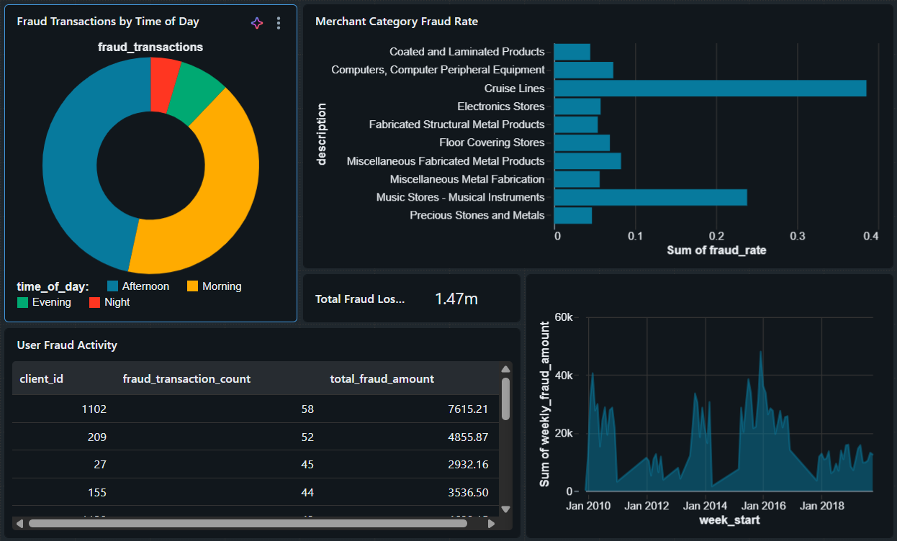
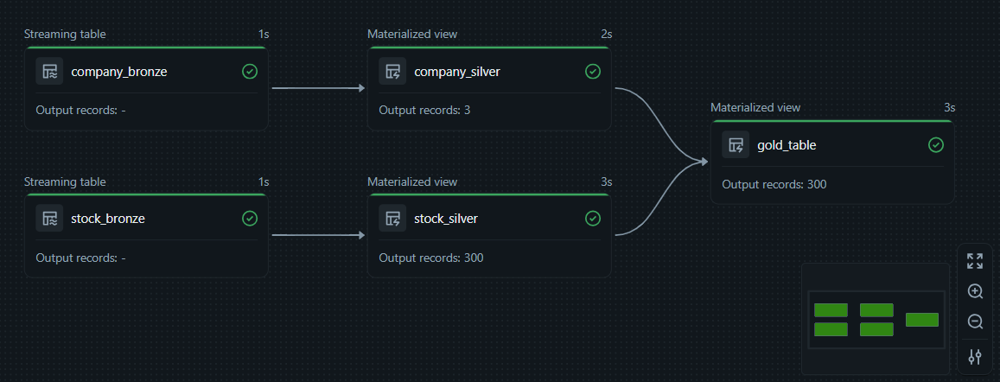
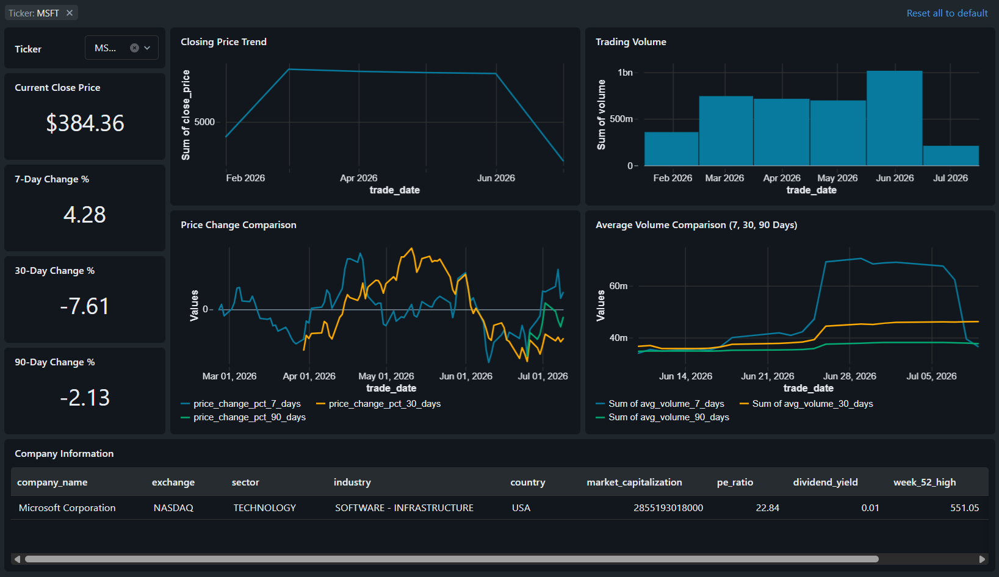

# Apache Spark Data Analytics Project

## Introduction

This project demonstrates how distributed data processing platforms can be used to ingest, transform, and analyze structured datasets at scale.

The project contains two main implementations:

* A Databricks-based implementation focused on ETL development, Spark DataFrame manipulation, Azure integration, Delta Lake, and analytical reporting.
* A Zeppelin and Hadoop implementation focused on economic analysis using the World Development Indicators dataset.

The project covers data ingestion, schema definition, transformation, aggregation, joins, distributed processing, and analytical reporting. The primary technologies used are Apache Spark, PySpark, Spark SQL, Databricks, Zeppelin, Hadoop, Hive Metastore, DBFS, Azure Databricks, Azure Storage, Google Cloud Platform, Delta Lake, JDBC, and structured Spark APIs.

---

# Azure and Databricks Implementation

## Dataset and Analytics

The Databricks implementation uses several structured datasets to demonstrate Spark-based ETL and analytical processing.

The pgExercises dataset contains information about members, facilities, and bookings. It is used to demonstrate relational analytics through Spark DataFrames and Spark SQL.

The Databricks notebooks include:

* [ETL pgExercises CSV Files](pyspark_ETL/0-ETLpgexercieses.ipynb)
* [Spark DataFrame Data Manipulation](pyspark_ETL/1-SparkDataManipulation.ipynb)
* [Spark ETL Jobs Exercises](pyspark_ETL/2-SparkETLJobs.ipynb)

The first notebook loads relational CSV datasets into Spark, defines schemas, and creates managed tables for downstream processing.

The second notebook uses Spark DataFrames and Spark SQL to perform analytical operations such as:

* Filtering and selecting records
* Joining members, bookings, and facilities
* Calculating booking totals
* Analyzing member recommendations
* Applying aggregations and window functions
* Producing facility usage reports

The third notebook extends the ETL workflow by processing data from multiple sources and storage formats, including CSV, Parquet, relational databases, and external services.

Next part of the Databricks project implement the Medallion Architecture using Bronze, Silver, and Gold layers.

The Azure Databricks notebooks include:

* [Bronze ETL Notebook](azure_databricks_ETL/ETL_Bronze.ipynb)
* [Silver ETL Notebook](azure_databricks_ETL/ETL_Silver.ipynb)
* [Gold ETL Notebook](azure_databricks_ETL/ETL_Gold.ipynb)

The Bronze layer preserves raw transaction, card, user, merchant category, and fraud label data. The Silver layer cleans and enriches these records. The Gold layer creates analytical tables for fraud reporting, including fraud trends, high-risk users, merchant-category fraud rates, transaction losses, and behavioural changes around fraudulent events.

The Databricks Delta Live Tables implementation includes:

* [Alpha Vantage Data Ingestion](databricks_DLT/alpha_vantage_ingestion.ipynb)
* [Bronze DLT Pipeline](databricks_DLT/01_bronze.sql)
* [Silver DLT Pipeline](databricks_DLT/02_silver.sql)
* [Gold DLT Pipeline](databricks_DLT/03_gold.sql)

This pipeline retrieves stock market data from the Alpha Vantage API and processes it through Bronze, Silver, and Gold layers. The resulting tables support analysis of stock prices, trading volume, rolling price changes, company information, market capitalization, sector, and industry.

## Architecture

The Databricks implementation uses Apache Spark as the distributed processing engine. Data is ingested from CSV files, relational databases, cloud storage, and external APIs before being processed through Spark DataFrames or Spark SQL.

DBFS and Delta Lake provide storage for raw and transformed datasets. Managed tables and Delta tables are registered through the Hive Metastore or Unity Catalog, allowing the data to be queried using Spark SQL.

Azure services are also used to support ingestion:

* JDBC connects Databricks to Azure SQL Database.
* Lakeflow Connect ingests relational data into Databricks.
* Azure Data Lake Storage stores CSV and JSON source files.
* Unity Catalog External Locations provide governed access to cloud storage.
* Azure Data Factory copies data from Azure Blob Storage into Databricks.

The transformed data follows the Medallion Architecture:

* Bronze stores raw source data.
* Silver contains cleaned and standardized records.
* Gold contains aggregated, business-ready datasets.

## Azure Medallion Pipeline

The Azure implementation uses several ingestion methods before the Bronze tables are created.

| Dataset                 | Source                  | Ingestion Method                |
| ----------------------- | ----------------------- | ------------------------------- |
| Transaction data        | Azure SQL Database      | JDBC                            |
| Card data               | Azure SQL Database      | Lakeflow Connect                |
| User data               | Azure Data Lake Storage | Unity Catalog                   |
| Merchant category codes | Azure Blob Storage      | Azure Data Factory              |
| Fraud labels            | Azure Blob Storage      | Azure Data Factory              |

After ingestion, the datasets are processed through the Bronze, Silver, and Gold notebooks.

### Bronze

The Bronze notebook loads each source dataset into Delta tables while preserving the original records. This layer provides a recoverable copy of the source data and serves as the starting point for downstream transformations.

### Silver

The Silver notebook applies data cleansing, type conversion, validation, enrichment, and joins. Transaction records are combined with card information, user information, merchant categories, and fraud labels.

### Gold

The Gold notebook creates analytical tables that answer fraud-related business questions, including:

* Fraudulent transactions by day of the week
* Fraud-rate trends
* Users with the highest number of fraudulent transactions
* Users with unusual transaction increases
* Merchant categories with the highest fraud rate
* Merchants with unusually high fraud volume
* Fraud distribution by time of day
* Fraudulent and non-fraudulent transaction amounts
* Daily monetary losses
* Weekly unique fraudulent users
* Monthly fraud patterns
* User behaviour before and after fraud events
* Fraud occurrence by transaction-value range

## Azure Databricks Dashboard

The Gold tables are used as sources for an interactive Databricks dashboard.

    

## Delta Live Tables Pipeline

The Delta Live Tables project automates the processing of stock market data using SQL-based streaming tables and materialized views.

The Alpha Vantage ingestion notebook retrieves historical price data and company information. The Bronze pipeline stores the raw datasets, the Silver pipeline cleans and deduplicates them, and the Gold pipeline creates analytical tables for dashboard reporting.

    

## Stock Analytics Dashboard

The Gold layer powers an interactive dashboard containing stock-price trends, trading-volume metrics, rolling averages, company comparisons, and ticker-based filtering.

    

---

# Zeppelin and Hadoop Implementation

## Dataset and Analytics

The Zeppelin implementation uses the World Development Indicators dataset. This dataset contains economic and development indicators for countries and regions across multiple years.

The notebook is available here:

* [Spark DataFrame - WDI Data Analytics](zeppelin_WDI_analytics/WDI_Data_Analytics.zpln)

The analysis focuses on GDP growth and demonstrates how Apache Spark can process large datasets stored through the Hadoop ecosystem.

The notebook performs the following operations:

* Loads WDI data from Hive tables
* Filters records by country and indicator
* Displays historical GDP growth for Canada
* Orders GDP growth records by year
* Calculates the highest GDP growth value for each country
* Joins aggregated results with the original dataset
* Identifies the year associated with each country's maximum GDP growth
* Compares Spark SQL queries with the PySpark DataFrame API
* Uses caching to improve repeated query performance

## Architecture

The Zeppelin notebook runs on a Hadoop cluster hosted in Google Cloud Platform.

Zeppelin provides the notebook interface used to execute PySpark, Spark SQL, and Scala code. Apache Spark performs distributed transformations across the cluster, while Hadoop provides the underlying distributed environment.

The WDI dataset is stored in Hive tables and accessed through the Hive Metastore. Spark reads the data into DataFrames, applies transformations and actions, and returns the results to Zeppelin for visualization.

The general data flow is:

1. WDI source data is loaded into Hadoop storage.
2. Hive tables expose the dataset through the Hive Metastore.
3. Zeppelin submits PySpark and Spark SQL jobs.
4. Apache Spark distributes the processing across cluster nodes.
5. Analytical results are returned to Zeppelin for display.

---

# Future Improvement

Several improvements could be applied to extend the project and make the pipelines more suitable for production environments.

### Automated Data Quality Validation

Data quality expectations could be added to validate null values, duplicate records, invalid transaction amounts, missing ticker symbols, and unexpected schema changes. Failed records could be redirected to quarantine tables for further investigation.

### Incremental Data Processing

The pipelines could be updated to process only newly added or modified records. Auto Loader, Change Data Feed, or timestamp-based incremental ingestion could reduce processing time and computational cost.

### Automated Testing

Unit tests and integration tests could be added for transformation logic, schema validation, joins, aggregations, and Gold-table calculations. Testing would help detect issues before pipeline deployment.

### Pipeline Monitoring and Alerting

Databricks Workflows could be configured with alerts for failed jobs, delayed ingestion, data-quality violations, and unexpected record counts. Operational metrics could also be written to monitoring tables.